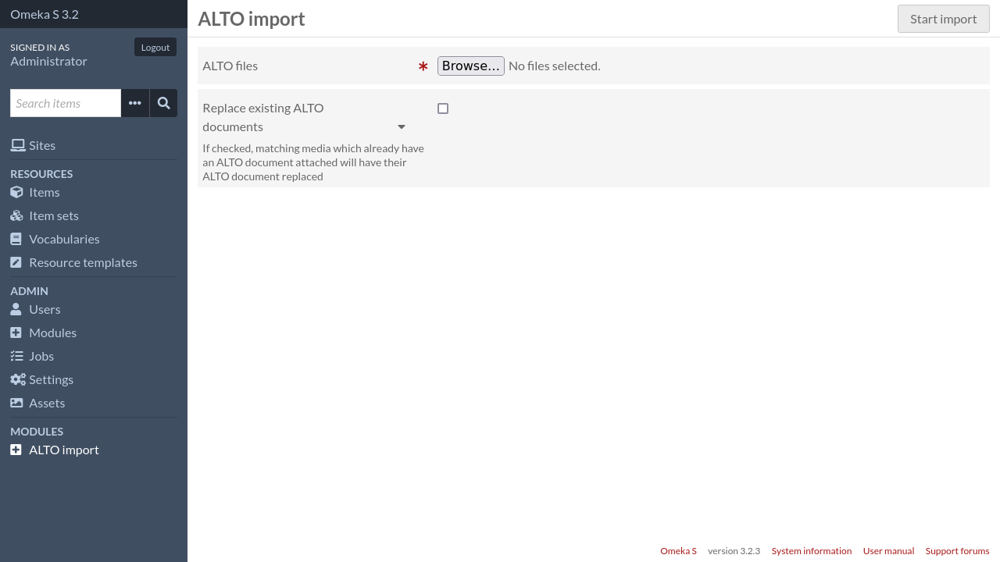

Attach ALTO to a media
======================

Manual import
-------------

1. To attach an ALTO document to a media, go the media page in the admin interface.

   .. image:: image/attach-alto-media-metadata.png

2. Click on the "ALTO" tab.

   .. image:: image/attach-alto-media-alto.png

3. Click on "Attach an ALTO document". A sidebar will open.

   .. image:: image/attach-alto-media-alto-ready-to-submit.png

4. Select your ALTO file and submit the form.

   .. image:: image/attach-alto-media-alto-submitted.png

Batch import
------------

To import multiple ALTO files at once, click on "ALTO import" in the admin navigation menu.

From there, you have to select all the ALTO files that you want to import.

.. important::
   ALTO files will be attached to media whose filename (or "source") match the ALTO filename.
   For instance, an ALTO file named ``PAGE0001.xml`` will be attached to the
   media whose filename matches ``PAGE0001.{extension}`` (eg. ``PAGE0001.png``).

   If no media or several media match, the ALTO file is not imported.

Options
^^^^^^^

Replace existing ALTO documents
    If checked, matching media which already have an ALTO document attached will have their ALTO document replaced
